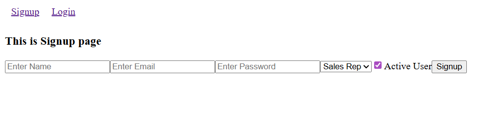

# 🚀 CRM System (Customer Relationship Management)

A full-stack **CRM (Customer Relationship Management) System** built to help sales teams manage leads, track customer interactions, and visualize sales performance through a secure and scalable platform.

---

## 🚀 Live Demo

🌐 **Live Application**  
https://crm-management-sayan-osbvuu1wq-rams-projects-eab30cd6.vercel.app/signup

---

## 📸 Screenshots

### Landing Page


---

### CRM Dashboard


---

### Add Lead / Activity


---

### Update Lead / Activity


---

## 🎥 Video Walkthrough

📽️ **Project Walkthrough on YouTube**  
https://youtu.be/PvS9AmP9jfo?si=v8xyTpv0GrP_xiOr

---

## 🛠 Features

- ✅ User Signup & Login
- ✅ JWT-based Authentication & Authorization
- 🚧 Role-Based Access Control (RBAC – in progress)
- ✅ Create, update, and delete leads / activities
- ✅ Track lead status and follow-ups
- ✅ RESTful backend API (CRUD operations)
- ✅ Form validation and error handling

---

## 📁 Project Structure

```
CRM_MANAGEMENT_SYSTEM/
│ 
├── backend/  
│   ├── config/  
│   ├── middlewares/
│   ├── models/
│   ├── node_modules/
│   └── routes/  
├── frontend/
│   ├── node_modules/
│   ├── public/
│   ├── src/
│   ├── assets/
│   ├── components/
│   ├── pages/
│   │    ├── dashboard/
│   │    └── landingPage/  
│   ├── utils/
│   ├──.gitignore
│   ├── eslint.config.js
│   ├── index.html
│   ├── package.lock.json
│   ├── tsconfig.app.json
│   ├── tsconfig.json
│   ├── tsconfig.node.json
│   ├── vercel.json
│   └── vite.config.ts   
├── LICENSE
└── README.md   
```

---
## 🧠 Concepts Demonstrated

### 🔐 Authentication & Security
- JWT-based authentication and authorization
- Secure password hashing using **bcrypt**
- Protected API routes using Express middleware
- Token-based access control for client–server communication

---

### 🧱 Backend Architecture & API Design
- RESTful API design (CRUD principles)
- MVC-style separation of concerns (Routes, Controllers, Models)
- MongoDB schema modeling using **Mongoose**
- Centralized error handling and standardized API responses
- Environment-based configuration using **dotenv**

---

### 🔄 Client–Server Communication
- Backend integration using `fetch` / `axios`
- Asynchronous programming with `async/await`
- JSON request/response handling
- HTTP status code handling and error propagation

---

### ⚛️ Frontend Development (React + TypeScript)
- Component-based UI architecture
- Strong typing with TypeScript interfaces and types
- Client-side routing using **React Router DOM**
- Reusable and composable React components
- Controlled forms and input validation

---

### 📊 Data Visualization & Analytics
- Sales and lead metrics visualization using **Recharts**
- Dynamic chart rendering based on API-driven data
- Data transformation for analytical dashboards

---

### 🔍 State & UI Management
- Local component state management using React hooks
- Conditional rendering based on authentication and user roles
- Loading, success, and error state handling for improved UX

---

### 🧪 Development Best Practices
- Modular and scalable project structure
- Separation of concerns across frontend and backend
- Secure handling of sensitive configuration and secrets
- Git-based version control with meaningful commits

---

### 🚀 Scalability & Future Readiness
- API structure designed for future feature expansion
- RBAC-ready backend architecture
- Prepared foundation for integrations (Email, SMS, Reporting)

---
> This project is designed with scalability and real-world sales workflows in mind, making it suitable for production-level CRM applications.


## 🔌 Backend API

The application exposes a RESTful API for authentication and CRM operations.

### Example Endpoints

- `POST /api/auth/register` – Register a new user
- `POST /api/auth/login` – Login user
- `GET /api/auth/me` – Get current authenticated user
- `GET /api/leads` – Fetch all leads
- `POST /api/leads` – Create a new lead
- `PUT /api/leads/:id` – Update lead details
- `DELETE /api/leads/:id` – Delete a lead

> Swagger / OpenAPI documentation will be added in future updates.

---

## 🧪 How to Run Locally

1. **Clone the repo:**
```bash
git clone https://github.com/rampravesh164191/CRM_Management_Sayan.git
```

2. **Navigate into the project:**
```bash
cd CRM_MANAGEMENT_SYSTEM
```

3. **Start backend server** 
```bash
cd backend
npm install
nodemon app.js
```

4. **Start Frontend**
```bash
cd frontend
npm install
npm run dev
```

---

## 🛠️ Tech Stack

### **Frontend**
- ⚛️ React
- 🟦 TypeScript
- 🔀 React Router DOM
- 📊 Recharts (Data Visualization)

### **Backend**
- 🟢 Node.js
- 🚂 Express.js
- 🍃 MongoDB with Mongoose
- 🔐 JWT (Authentication)
- 🔑 bcrypt (Password Hashing)
- 🌐 CORS
- ⚙️ dotenv (Environment Variables)

---

---

## 🌱 Future Improvements

* [ ] Complete Role-Based Access Control (RBAC)
* [ ] Sales rep–specific lead visibility
* [ ] Manager dashboard for team performance
* [ ] Admin panel for user & role management
* [ ] Email & SMS integrations
* [ ] Advanced reporting & exports
* [ ] UI improvements

---

## 📄 License

Licensed under [MIT License](./LICENSE)

---

## 👤 Author

**\[Ram pravesh Shamra]**
🔗 [Portfolio](https://your-portfolio.com)
🐙 [GitHub](https://github.com/your-username)
🐦 [Twitter](https://twitter.com/your-handle)

---


